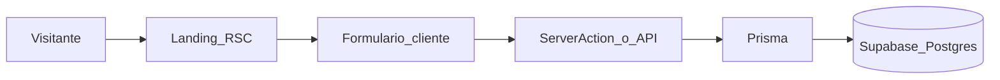

# Planeación: landing + waitlist (red de brokers)

Documento de referencia para el MVP de landing con waitlist que valida interés de mercado (**product-market fit**). Stack: **Next.js (App Router)**, **Prisma**, **shadcn/ui**, **Supabase (PostgreSQL)**. Despliegue objetivo: **Vercel**.

## Alcance de este documento (Fase A vs Fase B)

| Fase                         | Qué incluye                                                                                                                                                | Qué no incluye                                                                                                  |
| ---------------------------- | ---------------------------------------------------------------------------------------------------------------------------------------------------------- | --------------------------------------------------------------------------------------------------------------- |
| **Fase A (este entregable)** | Solo este archivo **Markdown** en `lib/docs/PROJECT_PLAN.md`: producto, MVP, arquitectura, landing, modelo de datos, env, dependencias, seguridad, despliegue. | **No** ejecutar `npm`, `npx`, `create-next-app`, Prisma, ni shadcn como parte de la creación de este documento. |
| **Fase B (posterior)**       | Bootstrap del repo: scaffold Next.js, Prisma + migraciones, shadcn, `.env.local`, Server Action del waitlist, deploy.                                      | Depende de que se inicie explícitamente otra sesión de implementación.                                          |

**Nota sobre el repositorio:** este documento vive en **`lib/docs/PROJECT_PLAN.md`**. El código de la app está en la raíz del repo (`src/`, `prisma/`, etc.). Si el estado del repo cambia, la fuente de verdad para el producto sigue siendo este archivo.

---

## 1. Contexto de producto

### Qué estamos construyendo

- Una **red privada de brokers inmobiliarios profesionales** en México, iniciando en **Monterrey**, orientada a **propiedades de ticket medio-alto**.
- Los agentes pueden **compartir inventario**, **colaborar entre ellos** y **cerrar operaciones más rápido** que trabajando en silos.

### Qué no es

- **No** es un CRM tradicional ni la promesa genérica de “otro software para inmobiliarias”.
- El producto completo se concibe como **plataforma + agente de IA en WhatsApp** que actúa como **copiloto operativo** del broker (fuera del alcance de esta fase).

### Hipótesis a validar con la waitlist

Existen **brokers dispuestos a unirse** a una red colaborativa con este posicionamiento (red privada, ticket medio-alto, colaboración real) **antes** de invertir en el desarrollo del producto completo. La landing y el formulario miden **intención** y permiten **capturar leads** para entrevistas o beta.

---

## 2. Alcance de esta fase (MVP)

| En alcance                                                                                                           | Fuera de alcance (fases posteriores)                          |
| -------------------------------------------------------------------------------------------------------------------- | ------------------------------------------------------------- |
| Landing pública con mensaje claro y formulario de waitlist                                                           | App completa de red, inventario compartido, chat interno      |
| Captura y almacenamiento de leads (ver **§5**): nombre, WhatsApp, email, número de propiedades, años en la industria | Integración WhatsApp / agente de IA                           |
| SEO básico y rendimiento (Core Web Vitals razonables)                                                                | Auth de usuarios, paneles, pagos                              |
| Despliegue en Vercel + base de datos en Supabase (ya creada)                                                         | Migraciones de dominio complejas más allá del modelo waitlist |

---

## 3. Stack y arquitectura (Next.js / Vercel)

### Principios

- **App Router** (`app/`): **Server Components por defecto** para la landing; **Client Components** solo donde haga falta interactividad (formulario, micro-interacciones).
- **Envío del formulario**: **Server Actions** (`"use server"`) o **Route Handler** (`app/api/.../route.ts`); validación en servidor con **Zod**.
- **Metadata SEO**: `export const metadata` o `generateMetadata` en `layout.tsx` o página principal (no usar `next/head` del Pages Router).
- **Estilos**: **Tailwind CSS** (incluido en create-next-app; base para shadcn).
- **shadcn/ui**: componentes **copiados al repositorio** (no es un paquete opaco). Inicialización no interactiva: `npx shadcn@latest init -d` (usar `--base radix` si en el futuro se integran piezas que dependan de Radix).
- **Prisma** sobre **PostgreSQL** de Supabase. En `schema.prisma`, `provider = "postgresql"`. Para **Vercel (serverless)**, usar connection string con **pooling** (PgBouncer en Supabase) cuando aplique; ver variables de entorno más abajo.
- **Secretos**: nunca commitear `.env.local`; mantener `.env.example` sin valores sensibles.

### Flujo de datos (alto nivel)

---

## 4. Landing page: secciones (estructura general)

Bloques típicos a implementar; el **copy detallado** se refinó en la sección 4.1.

1. **Hero**: titular, subtítulo, CTA hacia el formulario de waitlist.
2. **Propuesta de valor**: bullets (red privada, colaboración, ticket medio-alto, visión de copiloto IA en WhatsApp a nivel conceptual).
3. **Cómo funciona**: pasos genéricos (unirse → compartir inventario / colaborar → cerrar más rápido); puede evolucionar con contenido real.
4. **Prueba social o credibilidad**: logos, testimonios o estado “próximamente” según material disponible.
5. **Formulario waitlist**: **nombre**, **WhatsApp**, **email**, **número de propiedades**, **años en la industria**; consentimiento explícito si aplica (LFPDPPP, México). En implementación, validar formato de teléfono (p. ej. México `+52`) y tipos numéricos en servidor (Zod).
6. **Footer**: aviso de privacidad, términos (si aplica), contacto.

**Métricas sugeridas (post-lanzamiento):** tasa de conversión del formulario, fuente UTM, idioma **español**, tono **profesional**.

### 4.1 Copy orientativo (refinado con contexto de negocio)

Subsección para **refinar mensajes** antes o durante el diseño en Fase B. Uso interno para diseño de contenido; puede ajustarse.

| Sección                | Enfoque                                                                                                                                                                                                                                                                                           |
| ---------------------- | ------------------------------------------------------------------------------------------------------------------------------------------------------------------------------------------------------------------------------------------------------------------------------------------------- |
| **Hero**               | Título: red **privada** para brokers **profesionales** (Monterrey / México). Subtítulo: inventario compartido y colaboración, foco **ticket medio-alto**; no es un CRM más. CTA: “Únete a la lista” / “Solicitar acceso”.                                                                         |
| **Propuesta de valor** | • Red exclusiva para agentes alineados con operaciones serias. • Menos fricción al compartir oportunidades y cerrar con colegas. • Preparado para un **copiloto en WhatsApp** (IA) que apoye la operación diaria (mensaje futuro, sin prometer fecha).                                            |
| **Cómo funciona**      | 1) Dejas tus datos y perfil. 2) Acceso gradual a la red y lineamientos de colaboración. 3) Compartes inventario y colaboras para **cerrar más rápido**.                                                                                                                                           |
| **Credibilidad**       | Si aún no hay logos: “Construyendo la comunidad en Monterrey” o similar.                                                                                                                                                                                                                          |
| **Formulario**         | **Nombre**; **WhatsApp** (contacto principal, alineado al copiloto futuro); **email**; **número de propiedades** (entero, p. ej. cartera activa o volumen típico — definir etiqueta en UI); **años en la industria** (entero). Checkbox de aceptación de privacidad y uso de datos para contacto. |
| **Footer**             | Enlace a aviso de privacidad; contacto (ej. correo o formulario).                                                                                                                                                                                                                                 |

---

## 5. Modelo de datos mínimo (Prisma)

Sugerencia de entidad `**WaitlistEntry`** (nombre ajustable). Campos de negocio acordados para la waitlist:

| Campo             | Tipo        | Notas                                                                               |
| ----------------- | ----------- | ----------------------------------------------------------------------------------- |
| `id`              | UUID / cuid | PK                                                                                  |
| `name`            | String      | Nombre del broker o contacto                                                        |
| `whatsapp`        | String      | Teléfono WhatsApp; normalizar en validación (p. ej. E.164 con `+52` para México)    |
| `email`           | String      | Único, índice                                                                       |
| `propertyCount`   | Int         | Número de propiedades (criterio en UI: cartera activa, operaciones recientes, etc.) |
| `yearsInIndustry` | Int         | Años de experiencia en la industria inmobiliaria                                    |
| `createdAt`       | DateTime    | Default `now()`                                                                     |
| `source` / `utm`  | String?     | Opcional (campañas)                                                                 |
| `notes`           | String?     | Opcional, uso interno                                                               |

**Validación sugerida (Zod):** `email` formato email; `whatsapp` patrón o longitud acorde a MX; `propertyCount` y `yearsInIndustry` enteros ≥ 0 y techo razonable (p. ej. años ≤ 60) para evitar basura.

**Migraciones:** desarrollo local `prisma migrate dev`; producción `prisma migrate deploy`.

---

## 6. Variables de entorno (Supabase + app)

Valores reales solo en `.env.local` (local) y en el **dashboard de Vercel** (producción/preview). No commitear secretos.

| Variable       | Uso                                                                                                                                                                                                                |
| -------------- | ------------------------------------------------------------------------------------------------------------------------------------------------------------------------------------------------------------------ |
| `DATABASE_URL` | Connection string PostgreSQL. Para **serverless (Vercel)**, preferir **pooling**: en Supabase suele ser el host del pooler y puerto **6543** (modo **Transaction**), según documentación actual del proyecto.      |
| `DIRECT_URL`   | URL **directa** a Postgres (puerto **5432** sin pooler) para **migraciones** Prisma cuando el pooler no sea adecuado para ciertas operaciones. Recomendado en `schema.prisma` con `directUrl = env("DIRECT_URL")`. |

**Opcionales (fase 2):** `NEXT_PUBLIC_SUPABASE_URL`, `NEXT_PUBLIC_SUPABASE_ANON_KEY` si se usa **Supabase Client** (auth, storage, realtime). Para **solo waitlist vía Prisma**, no son estrictamente necesarias al inicio.

**Plantilla:** mantener `.env.example` con nombres de variables y placeholders.

---

## 7. Dependencias y comandos (checklist de creación)

### Orden recomendado

1. **Bootstrap Next.js:** `create-next-app` con TypeScript, ESLint, Tailwind, App Router (`src/` opcional según preferencia).
2. **Prisma:** `prisma init`, instalar `prisma` y `@prisma/client`, definir modelo y migración inicial.
3. **shadcn/ui:** `npx shadcn@latest init -d`; luego `npx shadcn@latest add` para componentes necesarios (p. ej. `button`, `input`, `label`, `card`).
4. **Entorno:** copiar `.env.example` → `.env.local`, rellenar `DATABASE_URL`/`DIRECT_URL`, verificar `prisma db pull` o `migrate` según flujo.

### Paquetes npm (referencia)

| Paquete                                     | Rol                                   |
| ------------------------------------------- | ------------------------------------- |
| `next`, `react`, `react-dom`                | Framework                             |
| `typescript`, `@types/node`, `@types/react` | Tipos                                 |
| `tailwindcss`, `postcss`, `autoprefixer`    | Estilos (típicamente ya en CNA)       |
| `prisma`, `@prisma/client`                  | ORM                                   |
| `zod`                                       | Validación server-side del formulario |
| `eslint`, `eslint-config-next`              | Lint                                  |

**Opcionales:** `@vercel/analytics` para analítica en Vercel; proveedor de email **Resend** (u otro) si en el futuro hay confirmación por correo o notificaciones.

### Scripts útiles en `package.json`

- `postinstall`: `"prisma generate"` — asegura cliente Prisma en CI/Vercel tras `npm install`.
- Build estándar: `next build`.

---

## 8. Calidad, seguridad y cumplimiento

- **Rate limiting** en la ruta de waitlist (o capa edge/middleware) para mitigar spam y abuso.
- **Validación** con Zod; no confiar solo en el cliente.
- **LFPDPPP (México):** aviso de privacidad y bases legales; **nombre, email y WhatsApp** son datos personales.
- `**DATABASE_URL` solo en servidor**; nunca en variables `NEXT_PUBLIC_`*.

---

## 9. Despliegue

- Conectar el repositorio a **Vercel** y replicar variables de entorno en el proyecto.
- Instalar **Vercel CLI** globalmente si se desea: `npm i -g vercel` — útil para `vercel env pull`, despliegues y logs desde terminal.

---

## 10. Fase B: checklist técnico (bootstrap; ejecutar en otra sesión)

Cuando se arranque la implementación, seguir en orden (detalle en sección 7):

1. **Next.js:** `create-next-app` (TypeScript, ESLint, Tailwind, App Router).
2. **Prisma:** `schema.prisma` con `WaitlistEntry`, `DATABASE_URL` + `DIRECT_URL`, primera migración.
3. **shadcn/ui:** `npx shadcn@latest init -d` y componentes necesarios (`button`, `input`, `label`, `card`, etc.).
4. **Waitlist:** Server Action o Route Handler + validación Zod (campos **§5**); conectar a Prisma.
5. **Entorno:** `.env.local` desde Supabase; `.env.example` sin secretos; variables en Vercel.
6. **Build:** `postinstall: prisma generate`; verificar `next build` en CI o local.

**Vercel CLI (opcional):** `npm i -g vercel` para `vercel env pull` y despliegues desde terminal.

---

## 11. Próximos pasos (post-waitlist / producto)

1. Ajustar copy y secciones con feedback de brokers y métricas de la waitlist.
2. Evolucionar hacia producto (red, inventario, copiloto WhatsApp) según roadmap.

---

## Documento de control de versiones

| Versión | Fecha      | Cambios                                                                                                 |
| ------- | ---------- | ------------------------------------------------------------------------------------------------------- |
| 1.0     | 2026-04-13 | Plan inicial: landing waitlist, stack, env, modelo de datos                                             |
| 1.1     | 2026-04-13 | Fase A solo Markdown; Fase B bootstrap diferido; nota estado del repo; sección 10 renumerada            |
| 1.2     | 2026-04-13 | Repo reducido a solo `docs/PROJECT_PLAN.md`; nota de estado actualizada                                 |
| 1.3     | 2026-04-13 | Campos de waitlist: nombre, WhatsApp, email, número de propiedades, años en industria (`WaitlistEntry`) |
| 1.4     | 2026-04-13 | Implementación Fase B; documento en `lib/docs/`; Prisma 7 + adapter `pg` |

