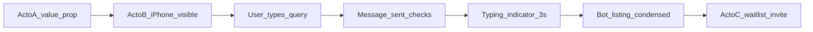

# Especificación de video: WhatsApp en iPhone (BrokerNetwork / IA)

Documento **cerrado** (v1 producción) para implementar en Remotion y embeber en la landing. Objetivo: que un broker entienda en **una sola pasada** de qué trata el producto. Alineado con `[PROJECT_PLAN.md](PROJECT_PLAN.md)`. **No** incluye código.

---

## 1. Metadatos fijos (v1)


| Campo                                        | Valor **único** v1                                                                                                                                                         |
| -------------------------------------------- | -------------------------------------------------------------------------------------------------------------------------------------------------------------------------- |
| **Composición raíz**                         | `BrokerNetworkPromo`                                                                                                                                                       |
| **Composición hija (opcional, dev)**         | `WhatsAppBrokerDemo` — misma escena recortada solo Acto B para iterar UI                                                                                                   |
| **Variante close-up (misma línea temporal)** | `BrokerNetworkPromoCloseUp` y `WhatsAppBrokerDemoCloseUp` — Acto B con mayor escala/legibilidad; el render principal sigue siendo `BrokerNetworkPromo` si no se elige otra |
| **Resolución de render**                     | **1080 × 1920** px (9:16)                                                                                                                                                  |
| **FPS**                                      | **30** (fijo; todo el guion en fotogramas se calcula a 30 fps)                                                                                                             |
| **Duración total**                           | **23,50 s** ≈ **705 fotogramas** (índices `0` … `704`)                                                                                                                     |
| **Rango aceptable de entrega**               | Línea base **~23,5 s**; variaciones cortas requieren nueva spec de `durationInFrames`                                                                                      |
| **Códec / contenedor**                       | MP4, H.264, **sin canal alpha**                                                                                                                                            |
| **Audio**                                    | **Silencio** en v1 (sin música, voz ni SFX). Si más adelante se añade música, es **fuera de alcance** de esta especificación.                                              |


**Tema visual único:** WhatsApp **modo oscuro** (§4). No se produce variante clara en v1.

---

## 2. Estructura narrativa (tres actos)


| Acto                | Segundos (aprox.) | Fotogramas @30fps | Función                                                                                           |
| ------------------- | ----------------- | ----------------- | ------------------------------------------------------------------------------------------------- |
| **A** — Valor       | **~7,67 s**       | 0–229             | Tres secuencias `<Sequence>` + copy §7.1 (nicho, IA; escena 3 solo titular **50 f**)              |
| **B** — Demo iPhone | **~12,87 s**      | 243–628           | Chat: escritura → envío → typing 3 s → respuesta bot (copy §7.3) → **~2 s** de hold antes del CTA |
| **C** — CTA         | **3,00 s**        | 615–704           | Waitlist (copy §7.4) + cierre (solape con fin de B vía crossfade)                                 |


**Duración efectiva:** **705 fotogramas** @30 fps (**23,50 s**); los crossfades A→B y B→C están contados dentro de la línea de tiempo continua (§6).

### Diagrama de flujo




---

## 3. Concepto en una frase

En **~23,5 segundos**, el video presenta en **tres bloques** la propuesta de valor (red privada, IA, resultado), muestra un **chat de WhatsApp** donde se pide una propiedad en lenguaje natural y un **bot responde tras 3 segundos** con un **resumen de listado**, y cierra invitando a la **lista de usuarios de prueba**.

---

## 4. Referencia visual única (WhatsApp oscuro)

### 4.1 Chat (Acto B)

- **Fondo del chat:** patrón oscuro tipo WhatsApp (`#0B141A` base).
- **Header superior:** barra `#202C33` o equivalente; texto `#E9EDEF`; iconos y chevron en `#8696A0` / blanco según contraste.
- **Nombre del chat (fijo):** `BrokerNetwork`  
- **Subtítulo bajo el nombre (fijo):** `en línea`
- **Burbuja saliente (usuario):** verde `#005C4B` / estilo WA dark; texto `#E9EDEF`; **doble check** gris → azul en el envío (§6).
- **Burbuja entrante (bot):** fondo `#202C33`, texto `#E9EDEF`, viñetas `•`; timestamp una sola línea `#8696A0` (ej. `3:16 p. m.`).
- **Número WhatsApp en la respuesta:** color `**#25D366`**, peso **600**.
- **Barra inferior:** campo “Message” / “Type a message”, micrófono; durante la respuesta del bot: **opacidad 0,85** fija (no animar salvo entrada inicial del Acto B).

### 4.2 Paleta cerrada (hex)


| Uso                                      | Hex       |
| ---------------------------------------- | --------- |
| Fondo app / exterior teléfono            | `#000000` |
| Fondo chat                               | `#0B141A` |
| Superficie burbuja bot / header          | `#202C33` |
| Burbuja usuario                          | `#005C4B` |
| Texto principal                          | `#E9EDEF` |
| Texto secundario / hora                  | `#8696A0` |
| Acento WhatsApp (solo número en listado) | `#25D366` |


---

## 5. Marco iPhone (Acto B)

- **Proporción:** rectángulo vertical; **radio de esquina del “cristal”** = **48 px** en coordenadas de composición 1080×1920.
- **Dynamic Island:** **sí** — elipse oscura centrada arriba, **ancho 120 px**, **alto 34 px**, a **12 px** del borde superior del área útil del cristal.
- **Safe area del contenido WhatsApp** respecto al borde interno del cristal: **mínimo 12 px** en los cuatro lados (header, lista, input respetan este inset).
- **Fuera del cristal:** **negro `#000000`** uniforme (sin gradiente en v1).
- **Sombra del dispositivo:** sombra única — `0 24px 48px rgba(0,0,0,0.45)` (valores de referencia CSS; en Remotion replicar equivalente).
- **Escala del teléfono en el lienzo:** el ancho del mockup (cristal) = **780 px** centrado horizontalmente; posición vertical: **centrado con ligero bias +2% hacia abajo** (offset `translateY +24 px` respecto al centro geométrico) para equilibrio visual bajo el island.

**Asset:** no hay PNG obligatorio en v1; el marco puede ser **vector/CSS** con los valores anteriores.

---

## 6. Guión frame a frame (705 frames, 30 fps)

Convención: **frame `f`** inclusive; duración = `f_fin - f_in + 1`.

### 6.1 Acto A — Valor (frames 0–229)

Tres `**<Sequence>**` consecutivas (cortes limpios entre escenas; sin solape). Escenas 1–2: título + subtítulo con **spring** (fade + slide up 20 px); el subtítulo entra **20 frames** después del título. **Escena 3:** solo titular (sin subtítulo ni footer). Animación en `AnimatedTextScene`.


| Secuencia             | `from` | `durationInFrames` | Rango global | Contenido (copy §7.1)       |
| --------------------- | ------ | ------------------ | ------------ | --------------------------- |
| 1 Nicho               | 0      | 90                 | 0–89         | Título + subtítulo escena 1 |
| 2 IA                  | 90     | 90                 | 90–179       | Título + subtítulo escena 2 |
| 3 Resultado (titular) | 180    | 50                 | 180–229      | Solo titular escena 3       |


**Transición A → B:** **crossfade** **frames 230–242** (13 f). Opacidad Acto A = 0 en frame **242**; Acto B domina a partir del frame **243**.

### 6.2 Acto B — Demo (frames 243–628)


| Frame in | Frame out | Duración | Acción visual                                                                                                                   |
| -------- | --------- | -------- | ------------------------------------------------------------------------------------------------------------------------------- |
| 243      | 257       | 15       | Entrada del iPhone: escala **0,96 → 1,00**, opacidad **0 → 1**. Misma curva ease-out expo.                                      |
| 258      | 272       | 15       | Hold: UI WhatsApp completa visible; input vacío o con placeholder estático.                                                     |
| 273      | 392       | 120      | **Simulación de escritura del usuario:** el texto §7.2 aparece **palabra a palabra** (texto completo visible al frame **392**). |
| 393      | 407       | 15       | **Envío:** la burbuja “salta”; aparecen **doble check** (gris).                                                                 |
| 408      | 497       | 90       | **Typing indicator del contacto:** **3,00 s** = **90 frames**. Ciclo **36 frames** en los tres puntos.                          |
| 498      | 512       | 15       | Entrada burbuja bot (shell): **fade + slide up** 10 px.                                                                         |
| 513      | 551       | —        | **Stagger** §7.3 desde frame **513** (+4 f por línea). Última línea a opacidad plena ~**551**.                                  |
| 498      | 555       | 58       | **Zoom** lento sobre el iPhone (**1,000 → 1,025**) en paralelo con la respuesta del bot.                                        |
| 552      | 611       | 60       | **Hold** tras respuesta completa: lectura + pulso en número `#25D366` (**2,00 s**). Sin pausa larga estática antes de esto.     |
| 612      | 626       | 15       | Pre-crossfade hacia Acto C (opacidad UI chat hasta **0,85** en frame **626**).                                                  |


**Transición B → C:** **crossfade** **frames 615–629** (15 f). Opacidad Acto B = 0 en frame **629**; Acto C = 1 en frame **629**.

### 6.3 Acto C — CTA (frames 615–704)


| Frame in | Frame out | Duración | Acción visual                                                                             |
| -------- | --------- | -------- | ----------------------------------------------------------------------------------------- |
| 615      | 629       | 15       | Fade in del bloque CTA (texto §7.4): opacidad 0→1, translateY **8px → 0**, ease-out expo. |
| 630      | 689       | 60       | Hold estático (lectura).                                                                  |
| 690      | 704       | 15       | Fade out a negro: opacidad global 1→0 (incluye texto y fondo).                            |


### 6.4 Versión corta (solo si se pide explícitamente)

- Requiere nueva especificación: acortar **Acto B** (bloque de respuesta del bot) y/o **Acto A** y ajustar `durationInFrames` en Remotion.

---

## 7. Copy exacto (canónico v1)

### 7.1 Acto A — Texto en pantalla (tres secuencias)

**Escena 1 — Nicho**

Titular:

```text
Una red privada de brokers de alto nivel.
```

Subtítulo:

```text
Inventario colaborativo de ticket medio-alto en Monterrey.
```

**Escena 2 — Tecnología**

Titular:

```text
Impulsada por Inteligencia Artificial.
```

Subtítulo:

```text
Busca y cruza propiedades en segundos, directamente en WhatsApp.
```

**Escena 3 — Resultado** (una secuencia, **50 frames**, globales **180–229**)

Titular:

```text
Cierra operaciones más rápido.
```

(No hay subtítulo ni línea de footer en esta escena en v1.)

### 7.2 Mensaje del usuario (burbuja saliente)

Texto literal (único permitido):

```text
Busco casa en renta con 2 plantas en colonia Tecnológico en Monterrey que sea pet friendly
```

### 7.3 Respuesta del bot (burbuja entrante) — versión única para video v1

Este es el **único** texto de respuesta para el render v1 (condensado para caber en el tiempo; sustituye listados largos anteriores):

```text
He encontrado 1 opción alineada a tu búsqueda:

• Ubicación: Col. Tecnológico, Monterrey, N.L.
• Casa · 2 plantas · 3 recámaras · pet friendly
• Renta: $24,000 MXN / mes
• Contacto WhatsApp: 528112868001

¿Te preparo la visita o busco más opciones?
```

**Reglas de maquetación:** la línea que contiene `528112868001` usa solo color `**#25D366`** para el número; el resto del cuerpo `#E9EDEF`.

### 7.4 Acto C — CTA waitlist

```text
Únete a la lista de usuarios de prueba.
Sé de los primeros en acceder a la red privada de brokers de Monterrey impulsada por inteligencia artificial
```

---

## 8. Tipografía y layout (Actos A y C)

### 8.1 Medidas (espacio composición 1080×1920)


| Elemento             | fontFamily | fontSize (px) | fontWeight | color                   | maxWidth (px) | alineación |
| -------------------- | ---------- | ------------- | ---------- | ----------------------- | ------------- | ---------- |
| Titular Acto A       | `Inter`    | **44**        | **600**    | `#FFFFFF`               | 896           | center     |
| Subtítulo Acto A     | `Inter`    | **28**        | **400**    | `#a3a3a3` (neutral-400) | 672           | center     |
| CTA Acto C (línea 1) | `Inter`    | **36**        | **600**    | `#FFFFFF`               | 920           | center     |
| CTA Acto C (línea 2) | `Inter`    | **26**        | **400**    | `#AEAEAE`               | 920           | center     |


- **Inter** debe cargarse en Remotion según `rules/fonts.md` (mismo archivo de fuente que la landing si ya existe).
- **Espaciado:** `line-height` ~1,15 en título; **margen** entre titular y subtítulo: **24 px** (`mt-6`).
- **Posición Acto A:** contenido **centrado vertical y horizontal** (`flex` + `items-center` + `justify-center`), **padding 32 px** (`p-8`).
- **Posición vertical Acto C:** bloque centrado en **y ≈ 720 px** (referencia anterior; ajustable).

### 8.2 Logo

**v1:** **sin logotipo gráfico.** Solo tipografía anterior. Si en el futuro se añade logo, nueva revisión del doc.

### 8.3 Zona segura “cinematográfica” (burn-in)

- Todo texto de Actos A y C debe estar dentro de un rectángulo central: **márgenes laterales mínimos 80 px**, **márgenes superior/inferior 120 px** (evita recorte en `border-radius` del reproductor o notch en móviles que recortan video).

---

## 9. Animación: lenguaje cinematográfico (reglas fijas)

1. **Acto A:** entradas con **spring** (componente `AnimatedTextScene`); subtítulo con **delay 20 f** respecto al título.
2. **Crossfade entre actos** A→B y B→C: ver §6 (sin solape de contenido entre Actos A y B salvo ventana de crossfade).
3. **Cámara:** en Acto B, durante **frames 498–555**, aplicar **zoom** sobre el grupo iPhone: escala **1,000 → 1,025** lineal (slow push-in).
4. **Transiciones entre actos:** **crossfade** según §6; **entre las tres secuencias del Acto A** se usan **cortes limpios** (una escena termina antes de la siguiente).
5. **Parpadeo del cursor** (si existe) en escritura: ciclo **20 frames** on/off.
6. **Typing dots:** ciclo **36 frames** (patrón de 3 puntos en opacidad, no traducir literalmente a “bounce” grande).

---

## 10. Integración en la landing (responsive)

El archivo entregado es **1080×1920**. En la web no se reescala el video con lógica distinta según dispositivo: el **contenedor** es responsive.

### 10.1 Comportamiento obligatorio (Next.js / HTML)

- Elemento: `<video playsInline muted loop autoPlay controls={false} />` (o equivalente; **muted** obligatorio para autoplay en iOS).
- **CSS mínimo del contenedor:**

```text
width: 100%;
max-width: min(420px, 100vw);
aspect-ratio: 9 / 16;
height: auto;
margin-left: auto;
margin-right: auto;
display: block;
object-fit: contain;
```

- **En viewport móvil (max-width 768px):** `max-height: min(72vh, 900px)` para que no empuje el CTA fuera de pantalla.
- **En desktop:** mismo `max-width: 420px` centrado en la columna del hero o lateral al copy; **no** estirar a ancho completo del monitor (evita pixelado y mala lectura).

### 10.2 Accesibilidad

- **Vídeo decorativo:** `aria-hidden="true"` en el `<video>` **o** `role="img"` con `aria-label="Demostración de BrokerNetwork en WhatsApp"` si el marketing prefiere anunciar contenido.

---

## 11. Componentes UI WhatsApp (Acto B) — capas

De atrás adelante:

1. Fondo `#000000` (lienzo).
2. Grupo **iPhone** (sombra + cristal + island).
3. **WhatsApp:**
  - **Header:** back, avatar circular **40 px**, nombre `BrokerNetwork`, subtítulo `en línea`, tres iconos derecha (siluetas `#8696A0`).  
  - **Área mensajes:** burbuja usuario arriba-derecha; burbuja bot abajo-izquierda con ancho máximo **72%** del ancho del cristal.  
  - **Input bar:** altura fija **56 px**, placeholder “Message”.

---

## 12. Remotion — implementación


| Ítem                         | Valor                                                                                                         |
| ---------------------------- | ------------------------------------------------------------------------------------------------------------- |
| `fps`                        | `30`                                                                                                          |
| `durationInFrames`           | `705`                                                                                                         |
| Composición principal        | `BrokerNetworkPromo`                                                                                          |
| Variante close-up (opcional) | `BrokerNetworkPromoCloseUp`, `WhatsAppBrokerDemoCloseUp` (mismas duraciones que las composiciones sin sufijo) |
| Entry                        | `[remotion/index.ts](../../remotion/index.ts)`                                                                |
| Comando preview              | `npm run remotion:studio`                                                                                     |
| Render                       | `npm run remotion:render` (ajustar al script real del `package.json`)                                         |


**Skill:** `.agents/skills/remotion-best-practices` — consultar `sequencing.md`, `timing.md`, `animations.md`, `text-animations.md`, `fonts.md`, `compositions.md`.

**Prueba de fotograma:** `npx remotion still BrokerNetworkPromo out/still.png --frame=229` (último frame de copy Acto A), `--frame=243` (inicio Acto B), `--frame=580` (hold tras respuesta bot).

---

## 13. Fuera de alcance de esta especificación

- Código fuente Remotion.
- Música, locución, SFX.
- Variante tema claro.
- Assets binarios (rutas bajo `public/` / `remotion/public/` al implementar).

---

## 14. Criterios de aceptación (QA)

- Duración del MP4 **23,50 s ± 0,05 s** a **30 fps** (705 frames).
- Acto A copy **exacto** §7.1 (tres secuencias; escena 3 solo titular); Acto C **exacto** §7.4; chat usuario §7.2; bot §7.3.
- Typing del contacto **90 frames** entre primer check y primer píxel de §7.3.
- Colores dentro de la tolerancia visual de §4.2 (hex).
- Embeddable según §10 sin deformar aspect ratio (sin barras laterales por `object-fit: fill`).

---

*Especificación cerrada v1 — landing · brokers · ~23,5 s · oscuro · sin audio.*